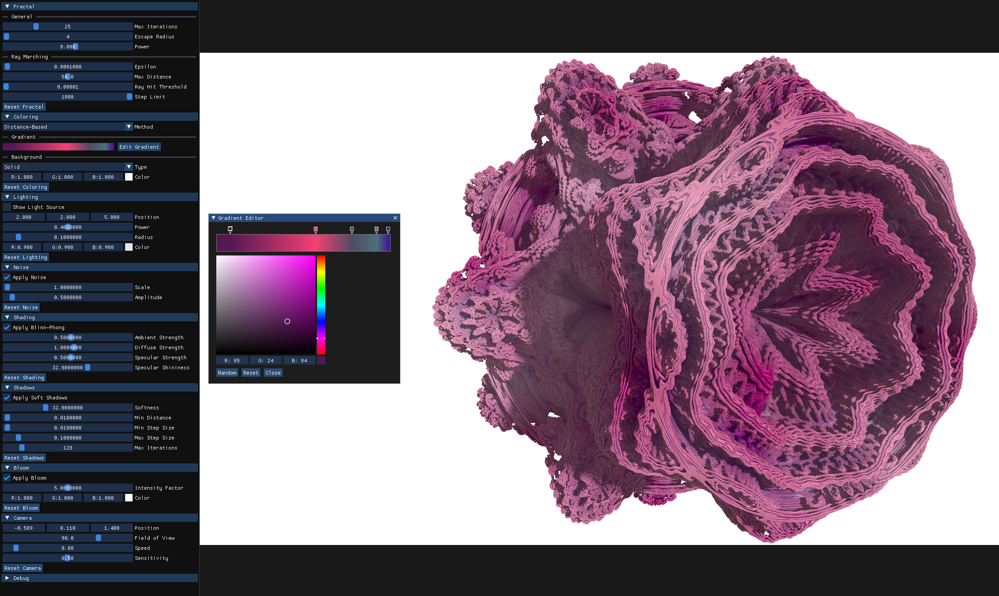

# Cloven

Cloven is a 3D fractal rendering application for Mandelbulb visualization. It provides an interface for manipulating fractal parameters and other rendering settings in real-time. The program was developed with an RTX 3080 and may perform poorly on lower-end GPUs. Windows is the only supported operating system.



## Features

- **Real-time Fractal Rendering**
  - Customizable fractal parameters
  - Gradient editor for coloring
- **Shading and Lighting**
  - Blinn-Phong shading
  - Soft shadows
  - Bloom
  - Noise
- **Coloring**
  - Distance-based coloring
  - Orbit trap coloring
- **User Interface**
  - Interactive camera controls
  - GUI for adjusting rendering settings

## Controls

- **W/A/S/D**: Move camera horizontally
- **Space**: Move camera up
- **C**: Move camera down
- **F**: Toggle fullscreen
- **G**: Toggle GUI
- **Left-Alt**: Toggle between GUI interaction and camera interaction
- **Esc**: Close the program

## Installation and Usage

### Building and Running in Visual Studio

1. **Clone the Repository:**
   ```sh
   git clone https://github.com/grantranda/cloven.git
   ```
2. **Enable Vcpkg Manifest:**

- Open project in Visual Studio.
- Set `Use Vcpkg Manifest` to `Yes` in `Configuration Properties`.

3. **Install Dependencies with Vcpkg:**
   ```sh
   vcpkg integrate install
   vcpkg install
   ```

4. **Build and Run the Solution:**

- Build the solution (Ctrl+Shift+B).
- Run the program (F5).

### (Optional) Generating an Executable with CMake in Visual Studio

1. **Create a Build Directory:**
   ```sh
   mkdir build
   cd build
   ```

2. **Run CMake:**
   ```sh
   cmake ..
   ```

3. **Open Generated ".sln" File in Visual Studio:**

- Navigate to the `build` directory.
- Open the generated `.sln` file.

4. **Set the Build Configuration:**

- In Visual Studio, set the build configuration to `Release` or `Debug`.

5. **Enable Vcpkg Manifest:**

- Set `Use Vcpkg Manifest` to `Yes` in `Configuration Properties`.

6. **Build and Run the Executable:**

- Build the Solution (Ctrl+Shift+B).
- Run the executable from the `build/Release` or `build/Debug` directory.

## License

This project is licensed under the GPL-3.0 License. See the `LICENSE` file for more information.
